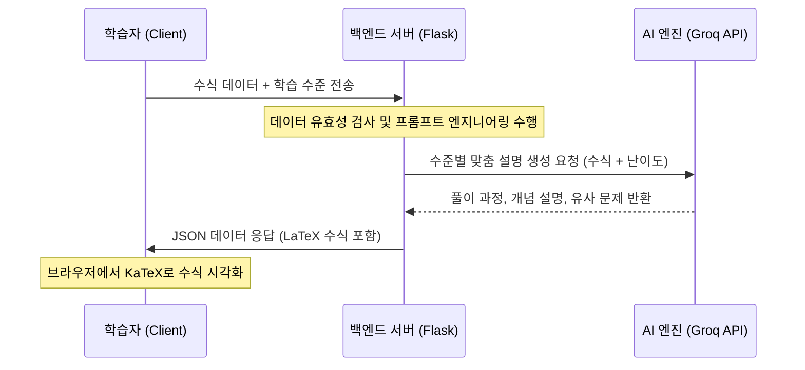

# 프로그램 개요서: 학습 밀착형 AI 공학계산기 (Edu-Math AI Calculator)

## 1. 프로젝트 개요 (Introduction)
### 1.1 개발 배경
현대 교육 환경에서 수학 학습은 정답을 맞히는 것보다 **수학적 원리를 이해하고 사고력을 확장**하는 것이 중요합니다. 그러나 기존의 공학계산기는 단순한 결과 도출에 치중되어 있어, 학습자가 계산 과정에서의 논리적 흐름을 파악하기 어렵다는 한계가 있습니다. 'Edu-Math AI Calculator'는 이러한 간극을 메우기 위해 AI 기술을 활용하여 계산 결과와 함께 맞춤형 학습 콘텐츠를 제공합니다.

### 1.2 타겟 사용자
- **학생**: 초등학생부터 대학생까지, 자신의 수준에 맞는 단계별 풀이와 원리 설명을 원하는 학습자.
- **교육자**: 학생들에게 수식의 원리를 효과적으로 설명하기 위한 보조 도구가 필요한 교사 및 강사.
- **독학자**: 복잡한 수식을 스스로 학습하며 유사 문제를 통해 개념을 다지고자 하는 개인.

---

## 2. 핵심 기능 상세 (Key Features)
### 2.1 지능형 수식 계산
- 복잡한 공학 수식 및 기호 해석.
- 정확한 수치 결과 값 도출 및 $\text{\LaTeX}$ 기반의 고해상도 수식 렌더링.

### 2.2 수준별 맞춤 설명 로직
학습자의 선택에 따라 답변의 깊이와 용어를 조절합니다.
| 대상 | 설명 스타일 | 교육 목표 |
| :--- | :--- | :--- |
| **초등** | 비유와 시각적 도구를 활용한 쉬운 설명 | 수학적 흥미 유발 및 기초 개념 정립 |
| **중/고등** | 교과 과정 내 핵심 정리 및 공식 유도 과정 포함 | 내신 및 수능 대비 문제 해결 능력 배양 |
| **대학생** | 전공 수준의 증명 및 응용 분야(공학, 물리 등) 연계 | 심화 이론 이해 및 실무 적용 능력 강화 |

### 2.3 학습 강화용 유사 문제 생성
- 풀이 완료 후, 동일한 원리를 적용할 수 있는 변형 문제를 생성하여 완전 학습(Mastery Learning) 유도.
- 단계별 힌트 제공을 통해 스스로 풀 수 있도록 지원.

---

## 3. 기술 스택 (Tech Stack)
### 3.1 Frontend
- **Vanilla JS (HTML5, CSS3)**: 프레임워크 오버헤드 없이 빠른 렌더링과 가벼운 실행 환경 구현.
- **MathJax / KaTeX**: 웹 환경에서 아름다운 $\text{\LaTeX}$ 수식 출력을 위한 라이브러리.

### 3.2 Backend
- **Python (Flask)**: 경량 웹 프레임워크로 AI API 연동 및 데이터 처리 로직의 빠른 프로토타이핑 가능.

### 3.3 AI Engine
- **Groq AI API**: 초고속 추론 기능을 제공하여 수식 해석 및 수준별 텍스트 생성을 실시간에 가깝게 처리.

### 3.4 Infrastructure
- **Git / Vercel**: 버전 관리 자동화 및 Serverless Function을 활용한 Flask 백엔드 배포 최적화.

---

## 4. 시스템 아키텍처 (Architecture)
본 시스템은 사용자 요청에 대해 실시간으로 대응하는 3-Tier 기반 시퀀스를 가집니다.



---

## 5. 상세 파일 구조 (Project Structure)
Vercel 배포 환경과 Flask 구조를 최적화한 디렉토리 설계입니다.

```text
/Edu-Math-Calculator
├── api/                # Vercel Serverless Functions (Flask App)
│   └── index.py        # 메인 백엔드 로직 및 API 엔드포인트
├── static/             # 프론트엔드 정적 파일
│   ├── css/
│   │   └── style.css   # UI 디자인 및 가시성 개선
│   ├── js/
│   │   └── main.js    # API 통신 및 DOM 제어
│   └── assets/         # 로고 및 아이콘
├── templates/          # HTML 템플릿
│   └── index.html      # SPA 기반 메인 화면
├── .gitignore          # 환경 변수 및 불필요 파일 제외
├── requirements.txt    # Python 의존성 (flask, groq, etc.)
├── vercel.json         # Vercel 배포 설정 파일
└── README.md           # 프로젝트 실행 가이드
```

---

## 6. UI/UX 가이드라인
### 6.1 수식 가독성 (Readability)
- 모든 수학 기호와 식은 반드시 $\text{\LaTeX}$ 문법을 사용합니다.
- 예: $x = \frac{-b \pm \sqrt{b^2 - 4ac}}{2a}$ 와 같이 복잡한 분수와 근호의 시인성을 확보합니다.

### 6.2 사용자 경험 (UX)
- **반응형 디자인**: 모바일과 태블릿에서도 수식을 확인하기 편하도록 레이아웃 최적화.
- **로딩 상태 표시**: AI 응답 생성 시간 동안 학습 동기 부여 문구 노출.

---

## 7. 향후 확장성
- **그래프 시각화**: `Chart.js` 또는 `Plotly` 연동을 통한 함수 그래프 출력.
- **학습 이력 저장**: 사용자의 취약 개념 분석 및 누적 학습 데이터 대시보드 제공.
- **멀티모달 입력**: 카메라 사진 촬영을 통한 수식 인식(OCR) 기능 통합.
